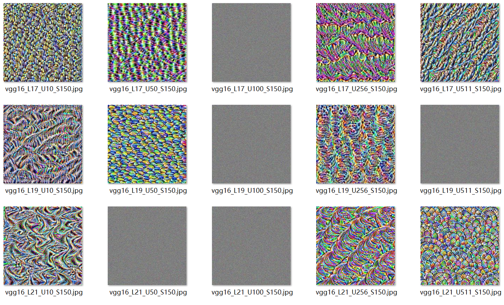

# Activation Maximization (VGG)
本项目基于 PyTorch 实现卷积神经网络的激活值最大化（Activation Maximization）。通过梯度上升算法，从随机噪声中合成能够使特定神经元产生最大响应的图像，以此可视化深度学习模型内部的特征偏好。

## 核心特性
- 参数化 CLI：支持通过命令行指定模型、层级（Layer）、神经元索引（Unit）以及优化超参数。

- 动态 Hook 捕获：使用前向钩子（Forward Hook）实时提取任意卷积层的激活状态。

- 自动化流水线：内置批量实验脚本，支持一键横向对比多个层级与神经元的特征图谱。

## Getting Started

1. 环境准备
```Bash
pip install torch torchvision pillow
```
2. 单次实验
在终端运行 `main.py`。例如: 默认探测 VGG16 的第 17 层第 511 号神经元：

```Bash
python main.py --layer 17 --unit 511 --steps 150 --lr 0.1
```

3. 批量实验
运行 `batch_run.py` 自动化执行预设的参数矩阵：

```Bash
python batch_run.py
```

## 项目结构

- `core/act_max.py` : 封装 ActMaxAnalyzer 类，处理梯度上升逻辑。

- `utils/image_utils.py`: 负责 Tensor 到 PIL 图像的转换与存储。

- `main.py`: 项目入口，处理命令行参数解析。

- `batch_run.py`: 批量实验调度脚本，利用 subprocess 自动化调用。

- `results/`: 自动生成的实验结果，文件名格式：`{model}_L{layer}_U{unit}_S{steps}.jpg`。

##  实验结果

- 请看截图，这个是根据`batch_run.py`生成的
  

### 为什么部分神经元的激活强度为 0 或输出全黑？

- **Dead ReLU（神经元死亡）**： ReLU 激活函数在输入小于 0 时梯度为 0。如果神经元的权重使其对当前输入（随机噪声）的响应始终处于负值区间，则无法产生梯度，导致图像停止更新。
- **特征高度特化（High Selectivity）**： 深层神经元（如 Layer 21+）通常是“高级专家”，它们只对特定的复杂结构（如狗脸、车轮）产生响应。随机噪声可能距离其“兴奋点”太远，导致梯度上升陷入局部平原。
- **负向特征检测**： 部分卷积核的作用是抑制特定背景特征。这类神经元在训练中主要负责输出负值或零，因此很难通过梯度上升激发其产生正向纹理。

### 优化建议

如果遇到输出不理想的情况，可以尝试：

- **增大学习率 (`--lr`)**：给优化器更大的初始步长以跳出平坦区。
- **增加迭代次数 (`--steps`)**：深层特征往往需要更多次的迭代才能从噪声中聚集成型
- **改进初始化策略**：修改 `core/act_max.py`，尝试使用均值更高的初始化或预训练图像作为起点